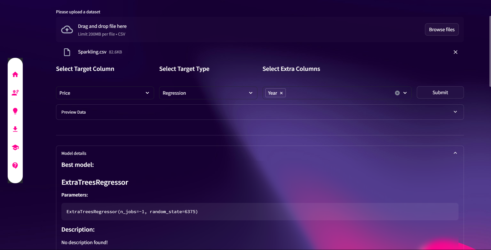

# SwiftML
A Streamlit-based browser interface for [PyCaret](https://pycaret.org/). You can use it as Machine Learning Model Generator!



## Website
If you wish to try this on web, you can do it in [here](https://swiftml.onrender.com/)!

# Feature
- Generate machine learning from any given dataset
- Currently supported formats : 
  - csv

# Installation and Running
- ## On Windows OS
### Prerequisite
To run this WebUI, you need to have `git`, `python` version 3.11.

Please follow the links below to install the necessary software:
- git : [https://git-scm.com/downloads](https://git-scm.com/downloads)
- python : [https://www.python.org/downloads/](https://www.python.org/downloads/) **( If your python version is too new, torch will not install properly.)**


If you have satisfied the prerequisites listed above, you are now ready to start Whisper-WebUI.

1. Run `Install.bat` from Windows Explorer as a regular, non-administrator user. 
2. After installation, run the `run.bat`. 
3. Open your web browser and go to `http://localhost:2907`

- ## Docker ( On Other OS )

1. Build the image

```sh
docker build -t swiftml:latest . 
```

2. Run the container with commands

- For bash :
```sh
docker run it swiftml:latest --server_name 0.0.0.0 --server_port 2907
```
- For PowerShell:
```shell
docker run -p 2907:2907 -it swiftml:latest --server_name 0.0.0.0 --server_port 2907
```